# Krishnan_Siranjevi_21274501_ISErepo

This repository contains the following files:

- `main.py`: This is the main Python script.
- `test.py`: This is a test script.
- `image/`: This folder contains images used in the repository.

# Numerology Application

Python application that performs various numerology calculations and operations based on a person's date of birth.

## Features

- Calculate Life Path Number (LPN) from a date of birth
- Check if a number is a master number (11, 22, or 33)
- Get the lucky color associated with a Life Path Number
- Compare Life Path Numbers of two different birthdays
- Determine the generation a person belongs to based on their date of birth
  
# Bash command to run my project
```
git clone https://github.com/SiranjeviKrishnan/Krishnan_Siranjevi_21274501_ISErepo.git
cd Krishnan_Siranjevi_21274501_ISErepo
python3 main.py
```

# Git Commands
```
git clone
```
### Use git clone to clone Krishnan_Siranjevi_21274501_ISErepo repository.
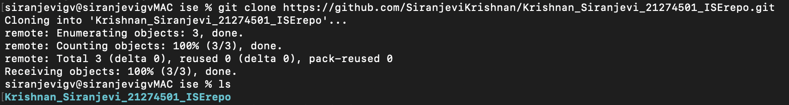

```
git add .
```
### Above command is used to add current directory files into git. In this case, i used it to add my main.py to my repo.
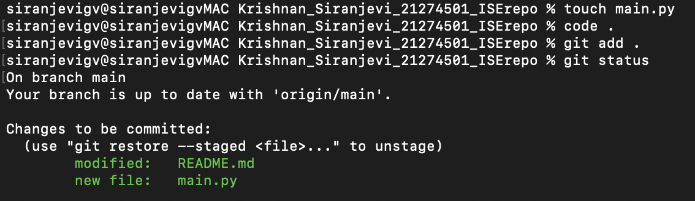

```
git commit
```
### Git commit is used to note changes with messages. I commited my main.py file after making changes in it.
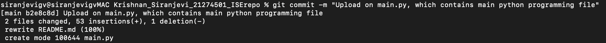

### Commited my main.py file after solving available issues and adding new features.
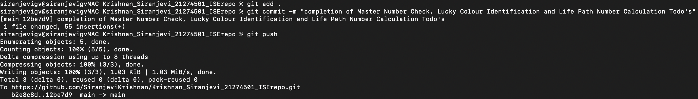

### I used dictionary instead of using conditional statement.
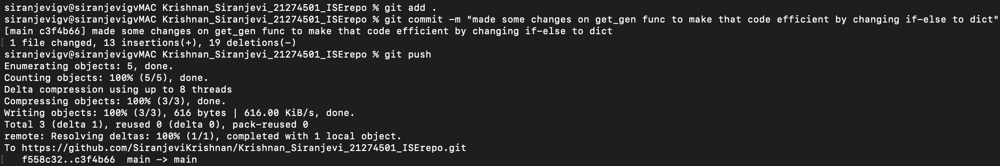

### After making complete changes to my main.py file, I commited my main.py.
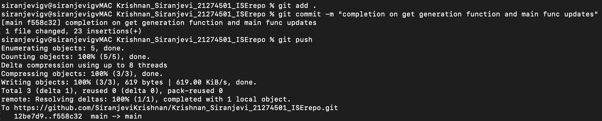

```
git status
```
### Git status is used to check state of your current working directory. In this I checked it to make sure about my previous commit.
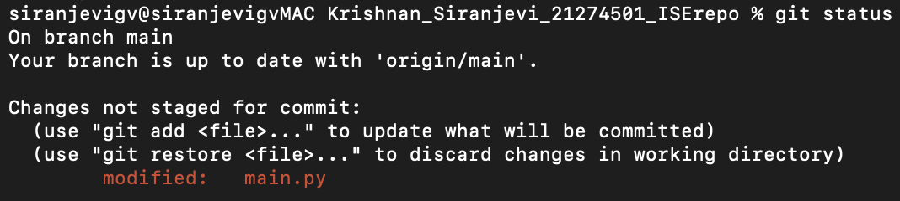

```
git push
```
### Git push is used to upload your previous commit and modifiles files.
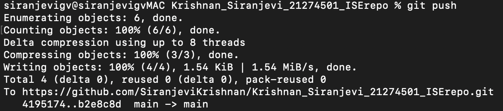

### Main screen of my main.py file.
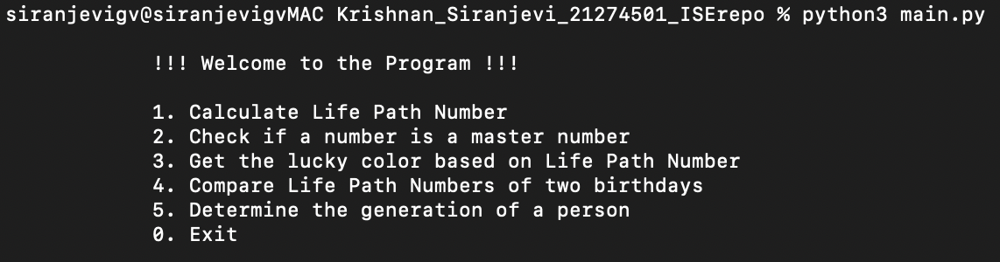

### I used git checkout to change from my main branch to test branch, which i used to make test cases for my main program.
```
git checkout
```
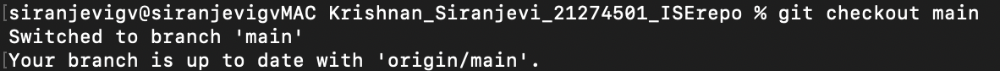

### Created test.py file to write an unittest for main.py file.
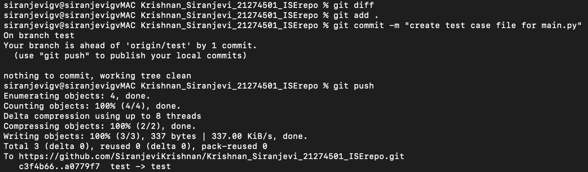

### I commited my test.py file into test branch after making some code changes.
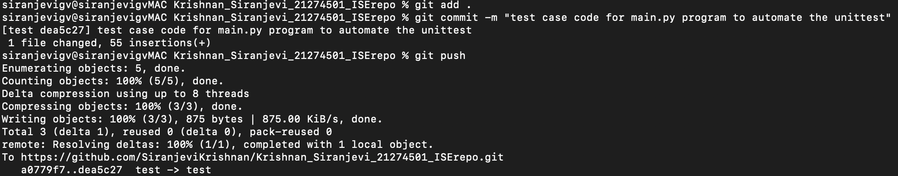

```
git fetch
```
### I used git fetch command to fetch changed data from test branch to update my directory if there are any changes.
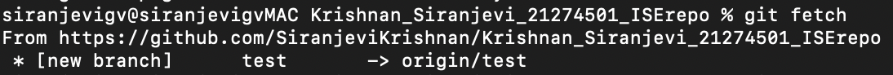

### After makink efficient changes on test.py file. Here is my final commit for test.py file.
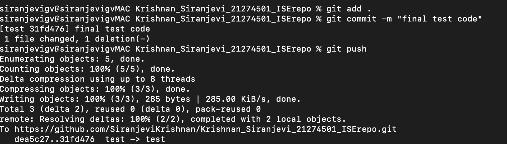

### Below image is my test.py file output, which performs unittest on my main.py at test branch.
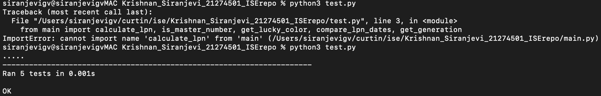

```
git merge
```
### After completing my project, I merged my main and test branch as a complete production branch.
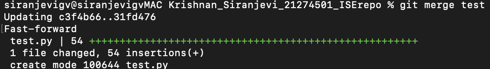
